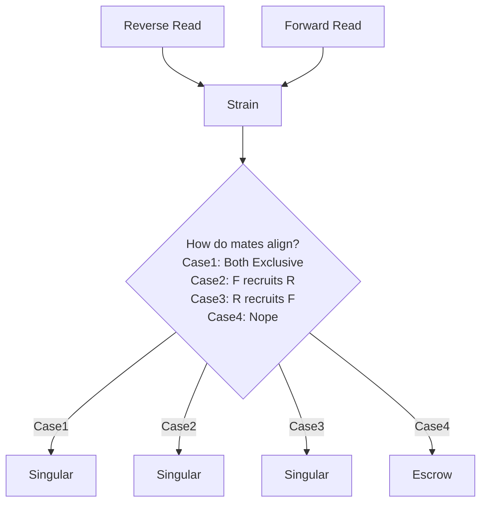

# NinjaMap

```mermaid {theme: default}
graph TD;
    S[Strain]
    F[Forward Read]
    R[Reverse Read]

    R-->S
    F-->S

    S-->A{How do mates align?<br>Case1: Both Exclusive<br>Case2: F recruits R<br>Case3: R recruits F<br>Case4: Nope}

    A-->|Case1|C1[Singular]
    A-->|Case2|C2[Singular]
    A-->|Case3|C3[Singular]
    A-->|Case4|C4[Escrow]
```
